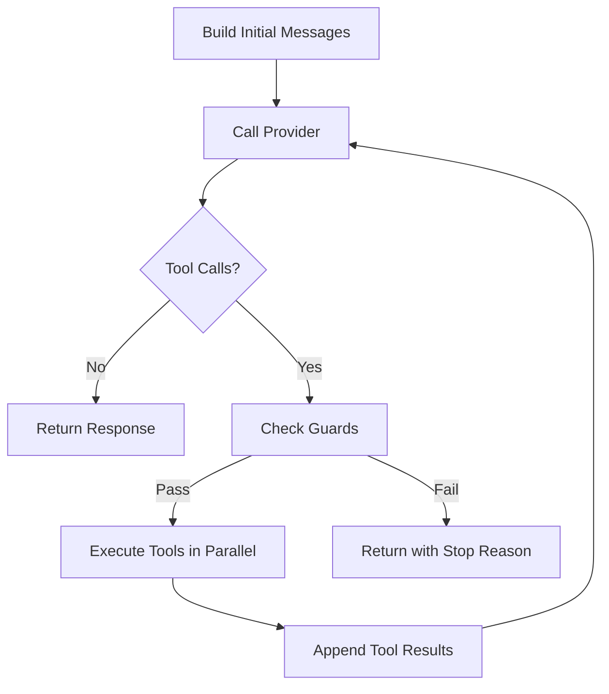

sclaw agents use the **ReAct** (Reason + Act) pattern — an iterative loop where the LLM reasons about the current state, decides on an action (tool call), observes the result, and repeats until it has a final answer.

## How It Works



Each iteration:

1. **Reason** — The LLM receives the conversation history (system prompt + messages + tool results) along with the list of available tool definitions, and generates a response.
2. **Check** — If the response contains no tool calls, the agent is done.
3. **Guard** — Before executing, safety guards check for loops, budget exhaustion, and timeouts.
4. **Act** — Tool calls are executed **in parallel** with panic recovery.
5. **Observe** — Results are appended to the conversation and the cycle repeats.

<Note>
Tool definitions are injected into every LLM call via `req.Tools`. The pipeline populates this field by calling `loop.ToolDefinitions()`, which collects all tools from the registry. See [Tools](/concepts/tools#tool-advertisement-to-the-llm) for details.
</Note>

## Guard System

Four guards protect against runaway agent loops:

| Guard | Config Field | Default | Behavior |
|-------|-------------|---------|----------|
| **Max Iterations** | `max_iterations` | `0` (unlimited) | Hard cap on the number of reasoning cycles. |
| **Token Budget** | `token_budget` | `0` (unlimited) | Cumulative token usage limit across all iterations. |
| **Timeout** | `timeout` | — | Wall-clock time limit for the entire invocation. |
| **Loop Detection** | `loop_threshold` | `0` (disabled) | Consecutive identical tool calls before breaking. |

<Warning>
Running without any guards (`max_iterations: 0`, no timeout) means the agent can loop indefinitely. Always set at least a `timeout` in production.
</Warning>

### Loop Detection

The loop detector tracks consecutive identical action signatures (tool name + arguments). When the same action repeats `loop_threshold` times in a row, the loop is broken with `StopReasonLoopDetected`.

```yaml
agents:
  main:
    loop:
      loop_threshold: 3  # Break after 3 identical tool calls
```

## Parallel Tool Execution

When the LLM requests multiple tool calls in a single response, sclaw executes them **concurrently**:

- Each tool runs in its own goroutine
- Panic recovery wraps each execution (one tool crash doesn't affect others)
- Results are collected and re-injected into the conversation in order
- Execution timing is recorded for each tool call

## Stop Reasons

The agent loop terminates with one of these stop reasons:

| Stop Reason | Description |
|-------------|-------------|
| `complete` | The model produced a final response (no tool calls). |
| `max_iterations` | `max_iterations` limit reached. |
| `token_budget` | Cumulative token usage exceeded `token_budget`. |
| `timeout` | Wall-clock `timeout` exceeded. |
| `loop_detected` | `loop_threshold` consecutive identical actions. |
| `error` | Provider error or context cancellation. |

## Streaming

Streaming is **enabled by default** for all agents. When active, the pipeline uses `RunStream()` instead of `Run()`, forwarding text chunks to the channel in real time. Channels that support streaming (e.g., Telegram) edit the response message progressively as chunks arrive.

If a channel does not support streaming, or if the stream initialization fails, the pipeline automatically falls back to the synchronous path — no user action required.

To disable streaming for a specific agent, set `streaming: false` in the agent configuration.

`RunStream()` returns a channel of `StreamEvent` values:

| Event Type | Description |
|------------|-------------|
| `StreamEventText` | Text chunk from the LLM. |
| `StreamEventToolStart` | A tool execution has started. |
| `StreamEventToolEnd` | A tool execution has completed (with result). |
| `StreamEventUsage` | Token usage update. |
| `StreamEventDone` | Final response with all metadata. |
| `StreamEventError` | Error (budget exceeded, loop detected, provider failure). |

<Tip>
Streaming is used by channel adapters to provide real-time response updates. For example, the Telegram channel edits the message progressively as chunks arrive. Configure `stream_flush_interval` on the Telegram channel to control how often edits are sent.
</Tip>

## Configuration Example

```yaml
agents:
  assistant:
    provider: "provider.openai_compatible"
    loop:
      max_iterations: 15       # Up to 15 reasoning cycles
      token_budget: 50000      # Max 50K tokens total
      timeout: "5m"            # 5-minute wall-clock limit
      loop_threshold: 3        # Break after 3 identical actions
```
