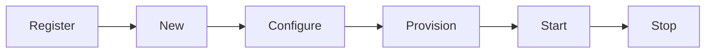
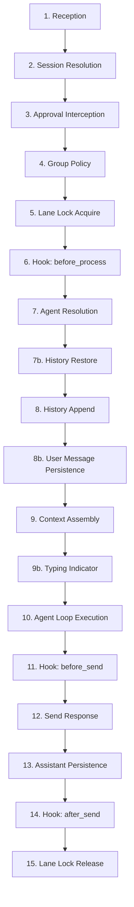

sclaw follows a Caddy-inspired modular architecture where the core handles orchestration while modules provide capabilities. Every component — channels, providers, memory backends, and tools — is a pluggable module.

## Module System

All modules implement the `Module` interface and are identified by a hierarchical ID:

```
<category>.<name>
```

Built-in categories:

| Category | Purpose | Example |
|----------|---------|---------|
| `channel` | Platform adapters (messaging) | `channel.telegram` |
| `provider` | LLM API integrations | `provider.openai_compatible` |
| `memory` | Persistence backends | `memory.sqlite` |
| `tool` | Agent capabilities | `tool.exec` |

Modules are registered globally via `core.RegisterModule()` and discovered at startup based on the configuration file.

## Module Lifecycle

Every module follows the same lifecycle:



| Phase | Description |
|-------|-------------|
| **Register** | Module declares its ID and constructor via `init()`. |
| **New** | Core calls the constructor to create a fresh instance. |
| **Configure** | YAML node is decoded into the module's config struct. |
| **Provision** | Module acquires resources (DB connections, API clients). |
| **Start** | Module begins processing (polling loops, HTTP servers). |
| **Stop** | Graceful shutdown — release resources, flush buffers. |

## 15-Step Message Pipeline

The heart of sclaw is the router's message pipeline. Every inbound message passes through these steps:



### Pipeline Steps Detail

| Step | Name | Description |
|------|------|-------------|
| 1 | **Reception** | Log the incoming message with channel, chat, and thread info. |
| 2 | **Session Resolution** | Get or create a session for the channel:chat:thread triple. |
| 3 | **Approval Interception** | Safety net — check if this message is an approval response. |
| 4 | **Group Policy** | Check if the message should be processed (mention-only in groups, etc.). |
| 5 | **Lane Lock** | Acquire per-session lock to serialize message processing. |
| 6 | **Hook: before_process** | Run pre-processing hooks (audit, filtering). |
| 7 | **Agent Resolution** | Create or retrieve the agent loop for this session. |
| 7b | **History Restore** | For new sessions, restore conversation history from SQLite. |
| 8 | **History Append** | Add the user message to session history. |
| 8b | **Persistence** | Write user message to SQLite (write-behind, non-fatal). |
| 9 | **Context Assembly** | Build the LLM request with system prompt (SOUL.md), history, and memory facts. |
| 9b | **Typing Indicator** | Show "typing..." indicator in the channel while processing. |
| 10 | **Agent Loop** | Execute the ReAct reasoning loop. |
| 11 | **Hook: before_send** | Run pre-send hooks on the outbound message. |
| 12 | **Send Response** | Deliver the response to the user via the channel. |
| 13 | **Assistant Persistence** | Save assistant response to history and SQLite. |
| 14 | **Hook: after_send** | Run post-send hooks (analytics, audit). |
| 15 | **Lane Lock Release** | Release the per-session lock. |

<Note>
Steps marked with "b" (7b, 8b, 9b, 13b) are substeps that execute conditionally. For example, 7b only runs when a new session is created and a HistoryResolver is configured.
</Note>

## Core Components

### Router

The router is the central message dispatcher. It receives inbound messages from channels, resolves sessions, and runs the pipeline. Key responsibilities:

- **Session management** — Maps channel:chat:thread triples to sessions
- **Agent routing** — Matches messages to agents based on routing rules
- **Lane locking** — Serializes per-session processing to prevent races
- **Approval management** — Handles tool approval request/response flow

### Provider Chain

Providers are organized into a failover chain with health tracking:

| Role | Behavior |
|------|----------|
| **Primary** | First choice for all requests |
| **Internal** | Used for system tasks (summarization, fact extraction) |
| **Fallback** | Activated when primary is unhealthy |

Health is tracked per-provider using success/failure counters with configurable thresholds.

### Hook Pipeline

Hooks execute at three points in the message pipeline:

| Position | When | Use Case |
|----------|------|----------|
| `before_process` | After session resolution, before agent | Audit logging, message filtering |
| `before_send` | After agent response, before delivery | Response modification, content filtering |
| `after_send` | After delivery to channel | Analytics, external notifications |

Hooks can return `ActionContinue`, `ActionDrop`, or `ActionModify` to control pipeline flow.
