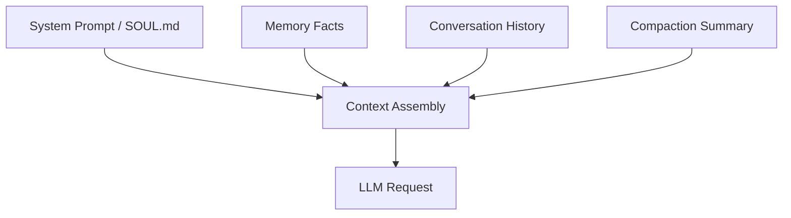

sclaw's context engine manages the token budget for each LLM request, assembling the optimal context from system prompts, conversation history, and memory facts while staying within the model's context window.

## Context Assembly

The `ContextAssembler` builds each LLM request by combining multiple sources:



Assembly follows a priority order:

1. **System prompt** (SOUL.md) — Always included, highest priority
2. **Compaction summary** — If present, prepended as context
3. **Memory facts** — Relevant facts from the Fact Store (budget-limited)
4. **Conversation history** — Recent messages, trimmed to fit

## Token Budget

The context engine tracks token usage to prevent exceeding the model's context window:

| Component | Budget Behavior |
|-----------|----------------|
| System prompt | Always allocated (non-negotiable) |
| Compaction summary | Allocated from history budget |
| Memory facts | Limited by `MaxTokens` parameter |
| History messages | Fills remaining budget, oldest trimmed first |

<Note>
Token estimation uses an approximation function — exact tokenization varies by model. The engine errs on the side of caution, leaving headroom for the model's response.
</Note>

## Compaction

When conversation history grows too large, the context engine triggers compaction:

### Normal Compaction

1. Messages older than the retention threshold are collected
2. An LLM summarizes them into a concise summary
3. The summary is stored via `HistoryStore.SetSummary()`
4. Only `RetainRecent` messages are kept alongside the summary

### Emergency Compaction

When the context window is critically exceeded (e.g., after a large tool output):

1. Only `EmergencyRetain` messages are kept (aggressive trim)
2. No summarization — just drop old messages
3. This is a last resort to prevent request failures

<Warning>
Emergency compaction loses context. Set appropriate `token_budget` and `max_iterations` limits to avoid hitting this path in production.
</Warning>

## History Trimming

The pipeline enforces a `MaxHistoryLen` cap (default: 100 messages):

- After appending user messages (Step 8)
- After appending assistant messages (Step 13)
- Oldest messages are dropped when the limit is exceeded

This prevents unbounded memory growth in long conversations, independent of token-based compaction.

## Memory Injection

The context engine queries the Fact Store for relevant long-term memories:

1. The current user message is used as the search query
2. Facts are ranked by BM25 relevance (FTS5)
3. Facts are added in rank order until the token budget is reached
4. The result is formatted as a Markdown section in the system prompt

```markdown
## Relevant Memory

- User prefers dark mode
- User's name is Alice
- User works on the backend team
```

<Tip>
Memory injection is automatic when a Fact Store is configured. The token budget prevents memory from consuming too much context — facts compete with history for the available budget.
</Tip>
