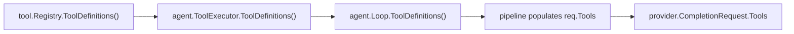

Tools are capabilities that agents can invoke during the ReAct loop. Each tool is a Go interface implementation that declares its name, description, JSON schema, required scopes, and default approval policy.

## Tool Interface

Every tool implements:

| Method | Description |
|--------|-------------|
| `Name()` | Unique identifier (e.g., `"exec"`, `"read_file"`). |
| `Description()` | Human-readable description for the LLM. |
| `Schema()` | JSON Schema defining the tool's input parameters. |
| `Scopes()` | Required permission scopes. |
| `DefaultPolicy()` | Default approval level (`allow`, `ask`, `deny`). |
| `Execute(ctx, args, env)` | Runs the tool and returns output. |

## Scopes

Scopes classify what a tool can do:

| Scope | Description |
|-------|-------------|
| `read_only` | Read files, query databases, inspect state. |
| `read_write` | Create, modify, or delete files and data. |
| `exec` | Execute arbitrary commands or code. |
| `network` | Make outbound network requests. |

Scopes are declared at registration time and used by the security system to enforce sandboxing and URL filtering policies.

## Approval System

The approval system controls whether tool calls execute automatically or require user confirmation:

| Level | Behavior |
|-------|----------|
| `allow` | Execute immediately without asking. |
| `ask` | Prompt the user for approval before executing. |
| `deny` | Always block execution. |

When a tool requires approval (`ask` policy), the pipeline:

1. Sends an approval request to the user via the channel
2. Waits for a response (with configurable timeout)
3. Executes or rejects based on the user's decision

<Note>
The approval manager uses a channel-based requester pattern — it sends the approval prompt through the same messaging channel (Telegram, Discord, etc.) that the user is interacting with.
</Note>

## Tool Advertisement to the LLM

For the LLM to invoke tools, it must know they exist. The tool registry exposes a `ToolDefinitions()` method that converts all registered tools into the `ToolDefinition` format expected by provider APIs (OpenAI-compatible `tools` array).

The definitions flow through the system in a chain:



At **Step 9 (Context Assembly)** of the message pipeline, the router calls `loop.ToolDefinitions()` and injects the result into the `agent.Request`. The agent loop then forwards these definitions to the provider on every LLM call, enabling the model to reason about and invoke any registered tool.

Each `ToolDefinition` contains:

| Field | Source |
|-------|--------|
| `name` | `Tool.Name()` |
| `description` | `Tool.Description()` |
| `parameters` | `Tool.Schema()` (JSON Schema) |

<Tip>
Tool definitions are computed at request time, not cached. This means tools registered after startup (e.g., via plugins) are automatically available on the next message.
</Tip>

### Workspace & Directory Context

In addition to tool definitions, the pipeline injects directory context into the system prompt:

- **Step 9c** — The agent's **workspace directory path**, so the LLM knows where file operations and command execution happen.
- **Step 9d** — Any **allowed directories** configured via `allowed_dirs`, with their access mode (read-only or read-write). This tells the LLM which external directories it can access using absolute paths.

Without this context, the LLM would see tools described as operating "in the workspace" but would have no way to know what that workspace is — leading it to refuse absolute path requests.

## Execution Environment

Each tool execution receives an `ExecutionEnv` with:

| Field | Description |
|-------|-------------|
| `Workspace` | Working directory for file operations. |
| `DataDir` | Agent's persistent data directory. |
| `SanitizedEnv` | Environment variables with secrets stripped. |
| `URLFilter` | Domain allow/deny list for network requests. |
| `PathFilter` | Allowed directories outside workspace (RO/RW). |
| `ApprovalRequester` | Interface to request user approval if needed. |

<Warning>
Tools always receive `SanitizedEnv` — never the raw `os.Environ()`. Sensitive environment variables (API keys, tokens) are automatically stripped to prevent accidental leakage.
</Warning>

## Sandboxing

Tools with `exec` or `read_write` scopes can be sandboxed in Docker containers:

```yaml
security:
  sandbox:
    enabled: true
    scopes_requiring_sandbox: ["exec", "read_write"]
    image: "sclaw-sandbox:latest"
    memory_mb: 512
```

See [Sandboxing](/security/sandboxing) for details.
