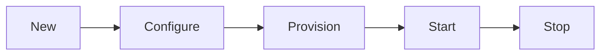

sclaw's modular architecture makes it easy to add new capabilities. Every module — channels, providers, memory backends, and tools — implements the same core interface and follows the same lifecycle.

## Module Interface

Every module must implement `core.Module`:

```go
type Module interface {
    ModuleInfo() ModuleInfo
}
```

Where `ModuleInfo` provides the module's identity and constructor:

```go
type ModuleInfo struct {
    ID  ModuleID            // e.g., "channel.telegram"
    New func() Module       // Constructor
}
```

## Module ID Convention

Module IDs follow the pattern `<category>.<name>`:

| Category | Purpose | Examples |
|----------|---------|---------|
| `channel` | Messaging platform adapters | `channel.telegram`, `channel.discord` |
| `provider` | LLM API integrations | `provider.openai_compatible`, `provider.anthropic` |
| `memory` | Persistence backends | `memory.sqlite`, `memory.postgres` |
| `tool` | Agent capabilities | `tool.exec`, `tool.weather` |

## Registration

Modules register themselves in `init()` using `core.RegisterModule`:

```go
package myplugin

import "github.com/flemzord/sclaw/internal/core"

func init() {
    core.RegisterModule(core.ModuleInfo{
        ID:  "tool.weather",
        New: func() core.Module { return &WeatherTool{} },
    })
}
```

<Warning>
`RegisterModule` panics if a module with the same ID is already registered. Module IDs must be globally unique.
</Warning>

## Lifecycle

After registration, modules go through a lifecycle managed by the core:



### Configure

The module receives its YAML configuration as a `yaml.Node`:

```go
type Configurable interface {
    Configure(node yaml.Node) error
}
```

Parse the YAML into your config struct:

```go
func (w *WeatherTool) Configure(node yaml.Node) error {
    return node.Decode(&w.config)
}
```

### Provision

Acquire resources (API clients, database connections, etc.):

```go
type Provisioner interface {
    Provision(ctx core.AppContext) error
}
```

The `AppContext` provides access to the logger, data directory, and other shared resources.

### Start / Stop

For modules that need to run background tasks:

```go
type Starter interface {
    Start(ctx context.Context) error
}

type Stopper interface {
    Stop() error
}
```

## Implementing a Channel

Channels connect sclaw to messaging platforms:

```go
type Channel interface {
    core.Module
    Send(ctx context.Context, msg message.OutboundMessage) error
    SetInbox(fn func(message.InboundMessage) error)
}
```

| Method | Description |
|--------|-------------|
| `Send` | Deliver an outbound message to the platform. |
| `SetInbox` | Register a callback for incoming messages. |

<Accordion title="Channel implementation example">
```go
type MyChannel struct {
    config struct {
        APIKey string `yaml:"api_key"`
    }
    inbox func(message.InboundMessage) error
}

func (c *MyChannel) ModuleInfo() core.ModuleInfo {
    return core.ModuleInfo{
        ID:  "channel.mychat",
        New: func() core.Module { return &MyChannel{} },
    }
}

func (c *MyChannel) Configure(node yaml.Node) error {
    return node.Decode(&c.config)
}

func (c *MyChannel) SetInbox(fn func(message.InboundMessage) error) {
    c.inbox = fn
}

func (c *MyChannel) Send(ctx context.Context, msg message.OutboundMessage) error {
    // Deliver msg to your platform
    return nil
}

func (c *MyChannel) Start(ctx context.Context) error {
    // Start polling or listening for messages
    // Call c.inbox(msg) when messages arrive
    return nil
}
```
</Accordion>

## Implementing a Provider

Providers connect to LLM APIs:

```go
type Provider interface {
    Complete(ctx context.Context, req CompletionRequest) (CompletionResponse, error)
    Stream(ctx context.Context, req CompletionRequest) (<-chan StreamChunk, error)
    ContextWindowSize() int
    ModelName() string
}
```

| Method | Description |
|--------|-------------|
| `Complete` | Synchronous completion request. |
| `Stream` | Streaming completion returning a channel of chunks. |
| `ContextWindowSize` | Report the model's context window size. |
| `ModelName` | Report the model identifier. |

## Implementing a Tool

Tools are capabilities that agents can invoke:

```go
type Tool interface {
    Name() string
    Description() string
    Schema() json.RawMessage
    Scopes() []Scope
    DefaultPolicy() ApprovalLevel
    Execute(ctx context.Context, args json.RawMessage, env ExecutionEnv) (Output, error)
}
```

| Method | Description |
|--------|-------------|
| `Name` | Unique tool identifier. |
| `Description` | Human-readable description (shown to the LLM). |
| `Schema` | JSON Schema for tool input parameters. |
| `Scopes` | Required permission scopes. |
| `DefaultPolicy` | Default approval level (`allow`, `ask`, `deny`). |
| `Execute` | Run the tool with given arguments. |

<Note>
Tools always receive a `SanitizedEnv` — never the raw environment. Use `env.URLFilter` for network requests and `env.Workspace` for file operations.
</Note>

## Testing

### Test Helpers

Place test helpers in a dedicated `<package>test/` sub-package:

```
internal/provider/
├── provider.go
├── chain.go
└── providertest/
    └── mock.go       # Test helpers
```

<Warning>
Never export test helpers in production packages. Use unexported functions with `_test` build tags, or place them in a `*test/` sub-package.
</Warning>

### Resource Cleanup

If a module acquires resources during provisioning, ensure cleanup in tests:

```go
func TestMyModule(t *testing.T) {
    m := &MyModule{}
    m.Configure(testConfig)
    m.Provision(testCtx)
    t.Cleanup(func() { m.Stop() })

    // Test...
}
```
